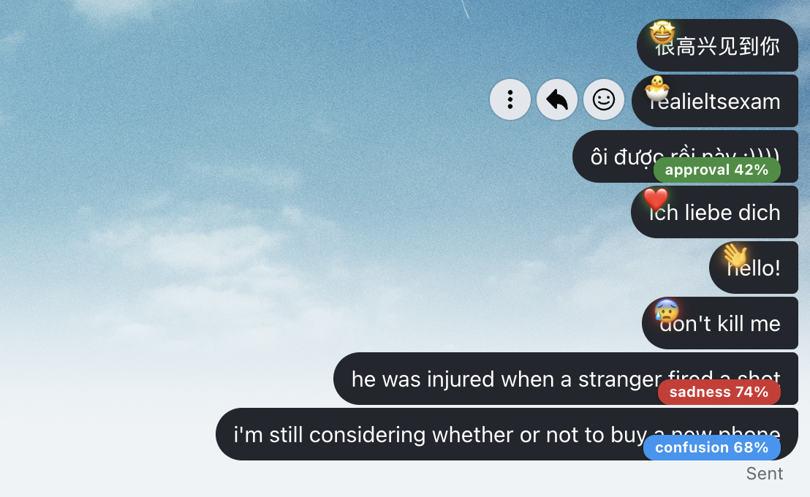

# Real-Time Emotion Browser Extension

<div align="center">
  
</div>

> **Ever read a text and wondered if the person was actually angry, or just being sarcastic?**

I built this browser extension to solve that ambiguity. It analyzes your chat messages in real-time and tells you the exact emotion behind the text (from 28 different categories like *Joy, Grief, Remorse, Admiration*), displayed right next to the message bubble.


<div align="center">
  
</div>

## 💡 The Idea

Text messaging lacks tone. Traditional sentiment analysis (Positive/Negative) isn't enough. I wanted something granular.

I trained a **Hybrid AI Model** that doesn't just look at the words (using DeBERTa) but also analyzes the grammar and punctuation (using Hand-Engineered Features). I then wrapped it in a Chrome Extension so it works on the apps people actually use: **Zalo** and **Facebook Messenger**.

## 🛠️ How It Works (The Tech Stack)

Since Deep Learning models are too heavy to run inside a browser, I split the architecture:

1.  **Frontend (Chrome Extension):**
    *   Built with **JavaScript (Manifest V3)**.
    *   Uses `MutationObserver` to watch the DOM. When a new message pops up, I grab it instantly.
    *   **Adaptive UI:** If it's a short "Hello", I just show a 👋 emoji. If it's a long rant, I show a detailed badge (e.g., "Anger 85%").

2.  **Backend (Python Server):**
    *   **FastAPI** for handling requests.
    *   **Model:** Microsoft's `deberta-v3-large` combined with a custom fusion head.
    *   **Processing:** I added a layer of "VADER Rescue" logic. Basically, if the AI gets confused by a factual sentence (e.g., "He got injured"), our rule-based logic steps in to ensure it's correctly flagged as Negative.


<div align="center">
  
</div>

## 📦 Installation

This is a local setup (Client-Server). You guyes need to run the backend for the extension to work.

```bash
cd server
# Install dependencies
pip install -r requirements.txt

# Place you guys 'best_model.pt' file inside the /server folder!

# Run the API
uvicorn main:app --reload
